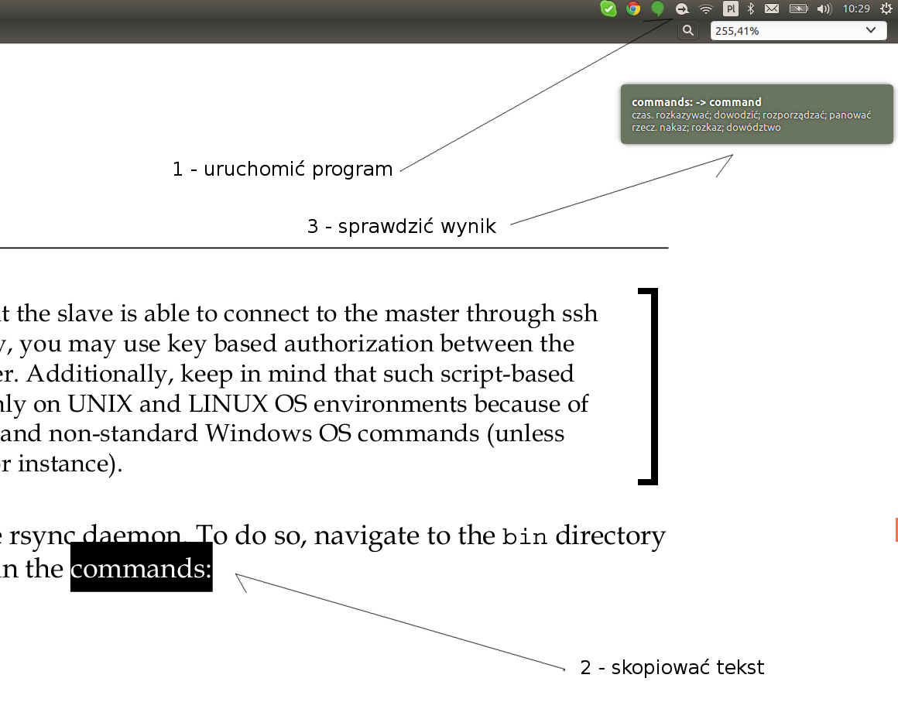

Cicero Ang-Pol Słownik
**********************

Lekki off-line-owy słownik angielsko-polski dla Ubuntu/Debian. Działa na zasadzie przechwytywania buforu schowka Ctr+C i notyfikacji systemowych do wyświetlania wyników. Aplikacja wymaga do prawidłowej pracy tylko standardowych pakietów z dystrybucji Ubuntu Desktop.

Master developer: Dawid Anioł

Podziękowania dla Andrzeja Tokarskigo z AjtSoft za udostępnienie bazy słów.

Instalacja / Uruchomienie z pakietu
===================================

- ściągnąć pakiet(zapisz link jako) DEB_
- zainstalować w systemie ``sudo dpkg -i cicero_ang_pol_slownik.deb``
- uruchomić program ``python /usr/local/bin/clipboard.py``
- po takiej instalacji program będzie dostępnu również w menu

Instalacja / Uruchomienie ze źródeł
===================================

- ``git clone https://github.com/feler404/cicero_ang_pol_slownik.git`` (ewentualnie zciągnąć i rozpakować zip)
- ``./scripts/run.sh``
- później wystarczy zaznaczyć interesujące słowo i nacisnąć ``Ctrl+C``

Pomoc
=====

Linki do projektów źródłowych
=============================
 - (Projekt Cicero) - http://feler404-3d.baynow.de/cicero/
 - (Strona AjtSoft) - http://www.ajt.com.pl

 .. _DEB: https://github.com/feler404/cicero_ang_pol_slownik/blob/master/build/cicero_ang_pol_slownik.deb